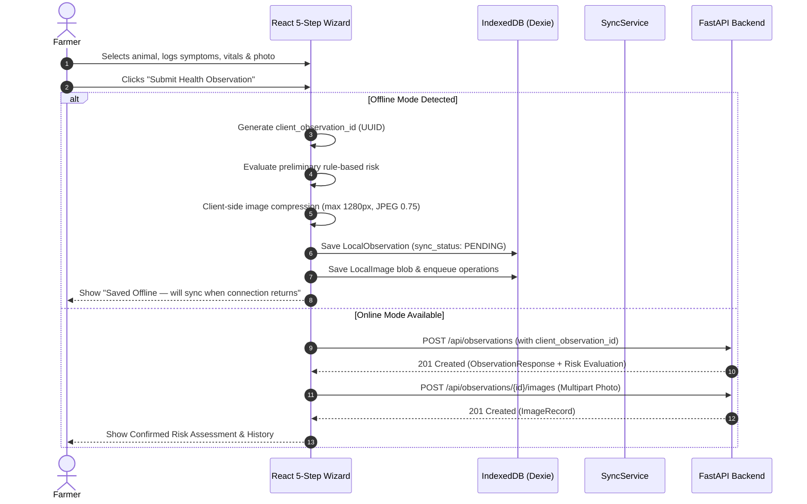

# Offline & Low-Bandwidth Mode Documentation

## 1. Overview & System Objectives
The **Livestock Health Monitoring and Disease Escalation System** is designed for smallholder farmers operating in rural and remote regions with intermittent or non-existent internet access.

Phase 4 introduces an offline-first architecture that ensures:
1. The web application loads offline via Progressive Web App (PWA) service worker caching.
2. Previously loaded livestock animals remain available for selection.
3. The 5-step health observation wizard allows complete field data collection while offline.
4. Animal photos captured in the field are compressed client-side and saved as binary blobs in IndexedDB.
5. Observations receive an idempotency token (`client_observation_id`) to prevent duplicate records upon sync.
6. A local rule-based risk evaluation calculates a **preliminary risk** indicator without misleading farmers.
7. Background and manual synchronization seamlessly push queued observations and images to the backend when connectivity returns.

---

## 2. IndexedDB Storage Architecture
Local storage is powered by **Dexie.js** (`LivestockHealthOfflineDB_v2`). The local database defines the following stores:

| Store Name | Primary Key | Indexed Fields | Purpose |
| :--- | :--- | :--- | :--- |
| `animals` | `id` | `animal_tag`, `species`, `farmer_id`, `is_active`, `synced_at` | Cached animal profiles for offline dropdown selection |
| `observations` | `local_id` | `server_id`, `animal_id`, `sync_status`, `created_at` | Locally captured observations awaiting server synchronization |
| `observationImages` | `id` | `local_observation_id`, `sync_status`, `created_at` | Compressed JPEG image blobs associated with a local observation |
| `syncQueue` | `id` (auto) | `operation_type`, `local_entity_id`, `parent_local_id`, `status` | FIFO synchronization queue tracking operation status & retry attempts |
| `appMetadata` | `key` | None | Stores sync timestamps (e.g., `animals_last_synced`) |

### Security & Privacy Rules
- **No Password Storage**: Authentication credentials and passwords are never stored in IndexedDB.
- **Farmer Scoping**: Local IndexedDB stores are wiped or re-synced on user change to prevent cross-account exposure.
- **Dynamic API Exclusion**: The Service Worker caches only static application assets (`/index.html`, JS, CSS, icons). Dynamic API responses (`/api/`) and uploads (`/uploads/`) are never cached globally by the Service Worker.

---

## 3. Offline Observation Workflow



---

## 4. Synchronization Engine & Duplicate Prevention

### Two-Phase Synchronization Sequence
When the application detects internet connectivity or when the farmer clicks **Sync Now**:
1. **Phase 1: Observations First**
   - The sync engine selects all `CREATE_OBSERVATION` operations from `syncQueue`.
   - Sends `POST /api/observations` including `client_observation_id`.
   - On response (201 Created or 200 Idempotent Replay), updates `LocalObservation` with `server_id` and marks `sync_status: SYNCED`.
2. **Phase 2: Dependent Image Uploads**
   - Once the parent observation has a valid `server_id`, the sync engine processes `UPLOAD_IMAGE` items.
   - Converts the local binary blob into a `File` object and uploads via `POST /api/observations/{server_id}/images`.
   - On completion, marks `LocalImage` as `SYNCED`.

### Idempotency & Duplicate Prevention
- **Client-Side UUID**: Each offline observation generates a unique `client_observation_id`.
- **Database Constraint**: `UNIQUE(recorded_by, client_observation_id)`.
- **Backend Recognition**: If a sync request arrives with a `client_observation_id` that already exists for that farmer:
  ```python
  if obs_in.client_observation_id:
      existing_obs = db.query(Observation).filter(
          Observation.recorded_by == current_user.id,
          Observation.client_observation_id == obs_in.client_observation_id
      ).first()
      if existing_obs:
          return existing_obs
  ```
  The existing observation is safely returned without creating duplicate rows, re-evaluating risk, or duplicating escalations.

### Retry Strategy & Exponential Backoff
- Failed requests increment `retry_count`.
- Up to **3 attempts** are performed with increasing delay.
- After 3 failures, the item is marked as `FAILED`.
- The user is notified via the **OfflineBanner** and can click **Retry Failed** to reset the queue.

---

## 5. Field Testing & Manual Verification Guide

### Test A: Online Observation
1. Log in as a farmer.
2. Navigate to **Record Health Observation** (`/observations/new`).
3. Complete all 5 steps and attach an image.
4. Verify HTTP 201 response, confirmed risk badge, and appearance in `/observations`.

### Test B: Offline Observation
1. In Chrome DevTools, open the **Network** tab and select **Offline**.
2. Navigate to `/observations/new`.
3. Confirm cached animals appear in the dropdown with "Animals last synced: HH:MM".
4. Select an animal, add symptoms, vitals (e.g., 39.8°C), and attach a photo.
5. Click **Submit Health Observation**.
6. Verify confirmation message: *"Saved offline — will sync when connection returns."*
7. Open IndexedDB in DevTools (`Application -> IndexedDB -> LivestockHealthOfflineDB_v2`) and confirm entries in `observations`, `observationImages`, and `syncQueue`.

### Test C: Reconnect & Automatic Synchronization
1. In DevTools, change Network from **Offline** back to **No throttling** (Online).
2. Observe the **OfflineBanner**: changes from amber "Offline" to blue "Synchronizing offline data...".
3. Verify network requests: `POST /api/observations` followed by `POST /api/observations/{id}/images`.
4. Observe the banner change to green "All data synced".
5. Navigate to the observation detail page (`/observations/:id`): verify server-validated risk level and uploaded photo display.

### Test D: Duplicate Replay Protection
1. Trigger a replay of the observation payload using `test_phase4.py` (`test_02_duplicate_client_observation_id_idempotency`).
2. Verify only 1 observation record exists in the database.
